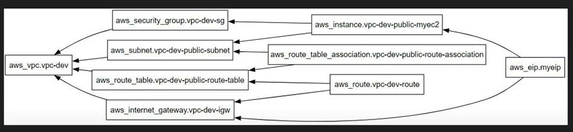
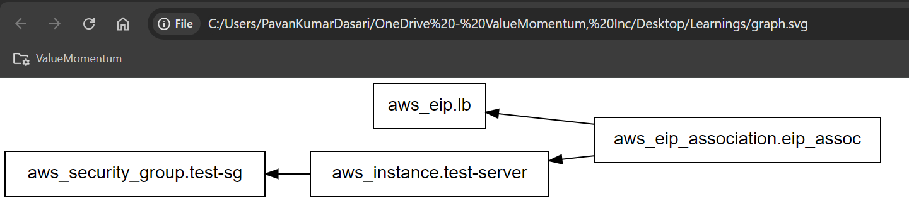
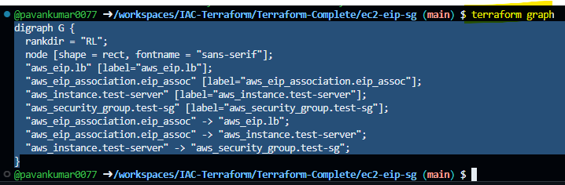
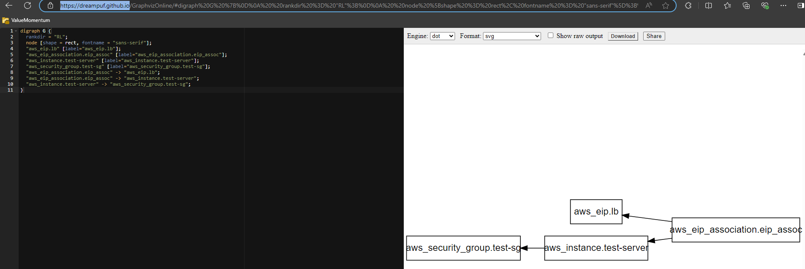

# Terraform graph

### Providers the graphical representation of terraform code.

- Example
- 

### Install graphviz 
- ref link - ``` https://graphviz.org/download/ ```
- ``` sudo apt install graphviz ```

- Command
- ``` terraform graph | dot -Tsvg > graph.svg ```
- It will generate a graph.svg file
- Open the file in the browser
- 

## NOTE : IF WE DON'T WANT TO INSTALL THEN USE ONLINE 

- Use command - ``` terraform graph ```
- Use or open link : ``` https://dreampuf.github.io/ ```

- 
- 