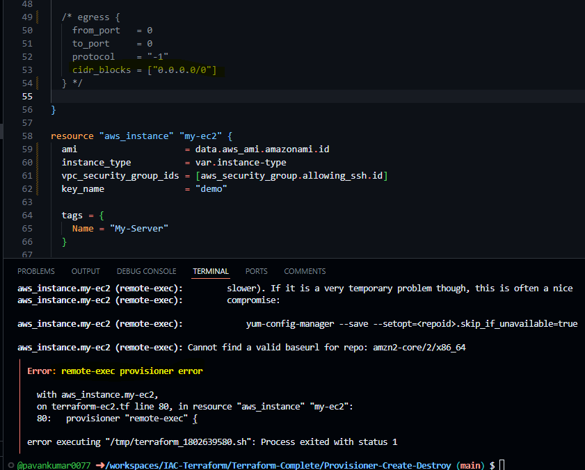
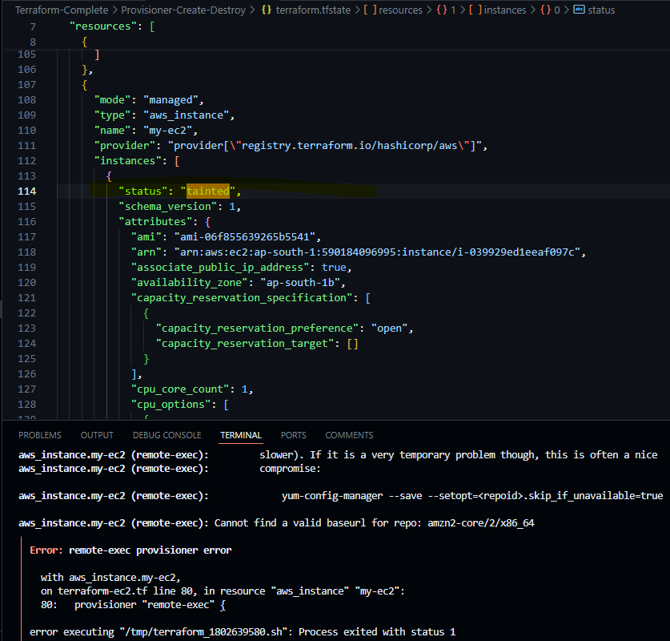
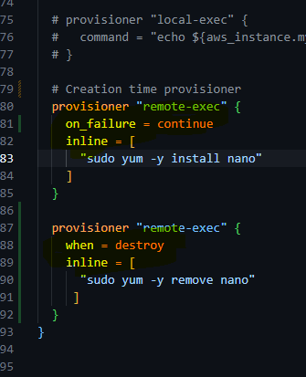

Provisioners Types
--
- There are 2 primary types of provisioners.
1. Creation Time Provisioner
2. Destroy Time Provisioner

Creation Time Provisioner
--
- It runs only during creation not during updating or other lifecycle of the provisioner
- If this fails due to any reason then the resource will be marked as tainted.
- 
- 

Destroy Time Provisioner
--
- It run before the resource is destroyed.

Provisioner Failure Behavior:
--
- Due to any reason, if provisioners get failed, this will cause the terraform apply as failed and this is the default property.

- THIS CAN BE CHANGED BY SEETING THE ON_FAILURE SETTINGS.

- Continue => It will ignore the error and continue with creation or destruction.

- Fail (default) => It will raise an error and stop applying. In case of creation-time provisioner, it will mark the resources as taint. So that resource will get replaced in next apply.

- 

