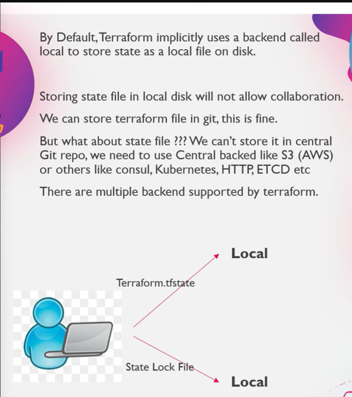
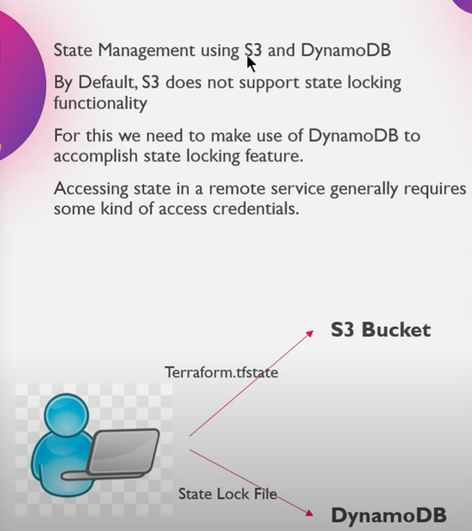
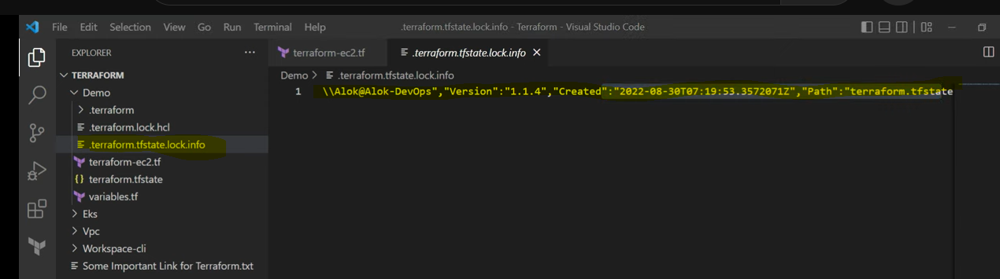
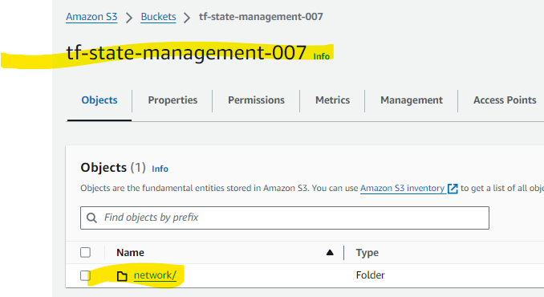
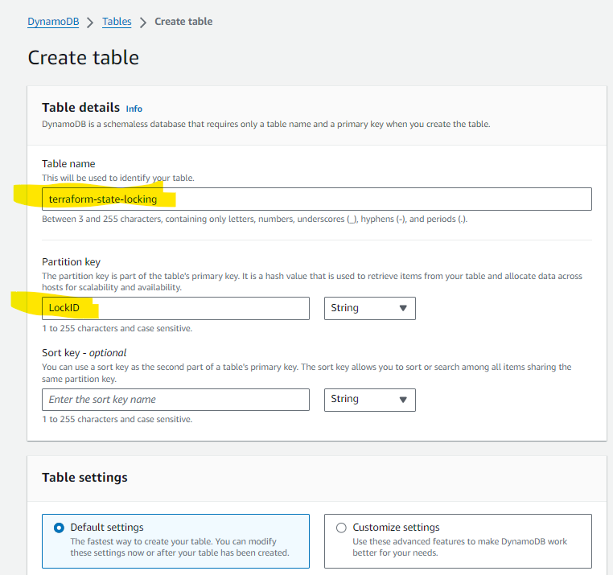
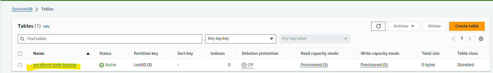
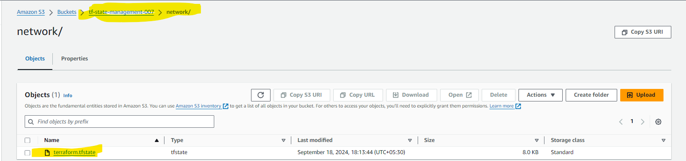
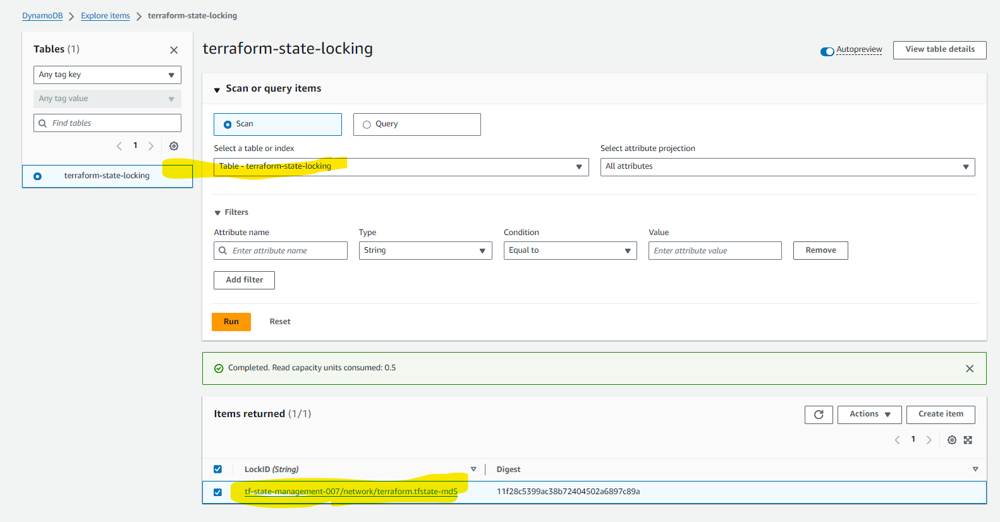
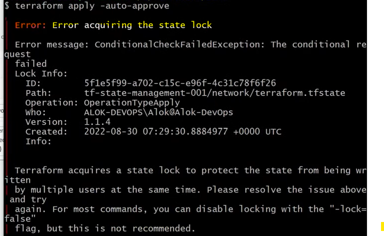

# STATE FILE MANAGEMENT

- 
- Terraform.tfstate and state lock file both are stored in local itself bydefault.
- 
- Ref Doc ``` https://developer.hashicorp.com/terraform/language/backend/s3 ```
- The state lock ( .terraform.tfsate.lock.info )will be deleted or removed when the actions are performed that's means after resources are created successfully.
- 
- In .terraform.tfstate.lock.info file - We can see the session details - session is created -- as soon as the resources are created the file will be deleted.

## Create S3 bucket
- 
- By default settings
- And in the bucket create a folder called network

## Create dynamo db table
- 
- Partition ID should be LockID as mentioned in the documentation.
- 


## Testing
- When we are trying to create a terraform resources like when we are trying to use ``` terraform apply ``` command we will get the lock file
- Now we can see that the state file is stored in s3 backend.
- 
- And dynamo table with session
- 
- AND WHEN ARE TRYING TO APPLY THE CHANGES OR OTHER DEV IS TRYING TO APPLY THIS INFRA CHANGES USING TERRAFROM SINCE WE HAVE LOCKING SYSTEM IT WILL BE SHOWING AN ERROR LIKE THIS.
- 
