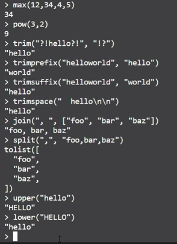

# Terraform Functions

- The Terraform language includes a number of built-in functions that you can call from within expressions to transform and combine values.
- The terraform language does not support user-defined functions, and so only the functions build in to the language are available for use.

- Ref link - ``` https://developer.hashicorp.com/terraform/language/functions ```

To enable console
--
@pavankumar0077 ➜ /workspaces/IAC-Terraform/Terraform-Complete/Terraform-Functions (main) $ ``` terraform console ```
> 4+5
9
> min)(12,4,5,90)

Numeric Functions
==
- 

Collection functions
--
- 

Realtime examples
--
- 
- 

Encoding Functions
--
- Ref link : ``` https://developer.hashicorp.com/terraform/language/functions/base64decode ```
- We are using USER-DATA while creating EC2 instance, But when we are using terraform we need to encrypt that USER-DATA (shell/bash script) and encoding functions

```
> base64encode("hello")
"aGVsbG8="
> base64decode("aGVsbG8=")
"hello"
>  
```

File system functions
--
- 

Template file
--
- Let's say for example if we are using user-data then we have install some pkg's so if we are hardcoding it, We have to write for same commands multiple times.
- IF WE USE ``` tmpl ```, template files then we can get the values from the variables file, So we can re-use it anywhere
- 

- 