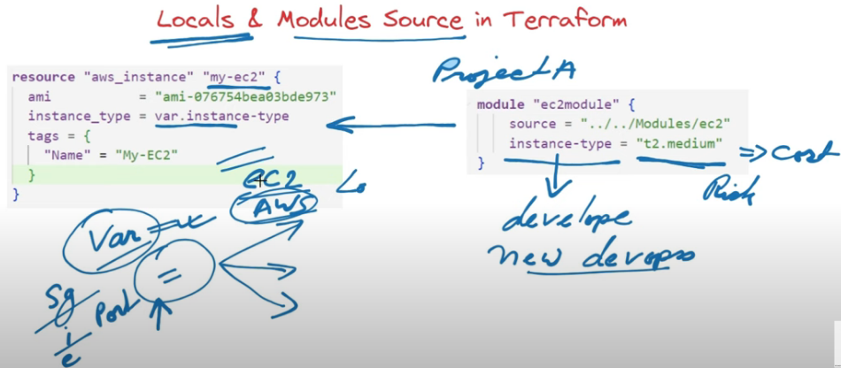
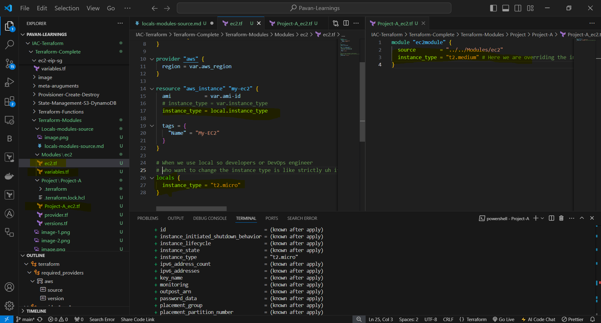

# LOCALS & MODULES SOURCE IN TERRAFORM

- In the previous examples of modules that we all know we can override the value right like let's say example in the previous example we have used instance type equal to T to medium right but we also mention in the variables like instant type is T2 micro so if you are giving a chance to override it so developers may use like higher instance so it should also comes under the cost as well right so we need to take care about this to prevent from this thing we have to use locals.

- 

- We are using local blog so that the instance type is like can't be overwritten by the developer when they are using IT
- 

- REF LINK = ``` https://developer.hashicorp.com/terraform/language/modules/sources ```

- 

- 

- Source can be any as mentioned in documentation.
