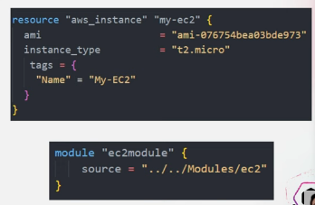
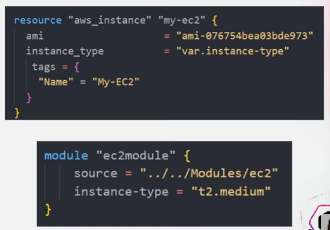
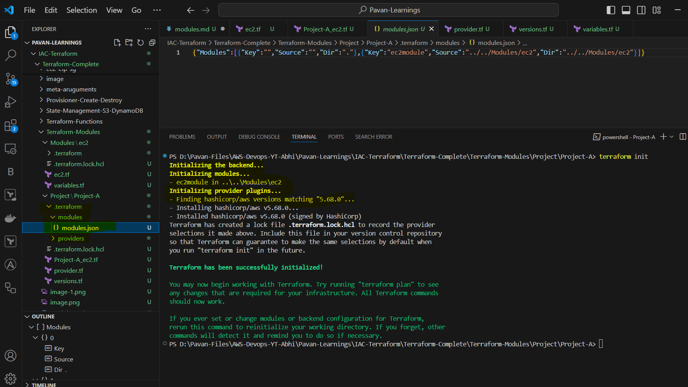

# MODULES

DRY PRINCIPLE
==
- The DRY principle in Software development stands for don't repeat yourself.
- It is a fundamental concept that encourages developers to avoid duplicating code or logic in a system.
- The main goal of the DRY principle is to improve the maintainability and scalability of software systems
- The goal of the following dry principle is to reduce reductancy improve maintainability and make code easier to understand and modify.
- This principle applies not only to traditional software development but also to infrastructure as code IAC tools like terraform.

Modularization
==
- Instead of writing similar infrastructure code repeatedly you can create reusable terraform modules
- Modules allow you to define a set of resources variables and outputs in one place and then reuse them in multiple parts of your terraform configuration
- This promotes code reusability and reduce duplication

- 

- Terraform modules are defined in their own files and can be imported into your main terraform configuration
- Each module can have its own set of inputs and outputs
- You can also nest modules inside each other to create a hierarchical structure
- This allows you to break down complex infrastructure into smaller reusable pieces
- Terraform modules can be used to create reusable infrastructure components such as virtual networks subnets and security


Variables and Input Parameters
==
- Use terraform variables to parameterise your configurations instead of hard coding values throughout your code define variables that you can easily changed when needed.
- This allows you to reuse the same module or configuration with different input values.

- 


- 

- When you add a new module to a configuration, Terraform must download it before it can be used.
- ``` terraform get ``` or ``` terraform init ```