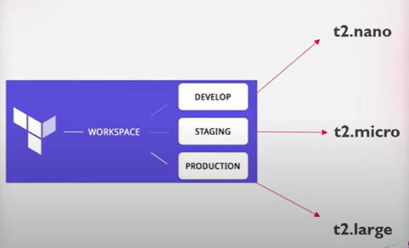

# WORKSPACE's

- Create multiple Env's like QA, PROD, DEV
- Terraform workspace help you keeping your infrastructure consistent and use a single manifest to create many of the same things again and agina.
- Working with terraform invloves managing collections of infrastructure resources.

- 
- 