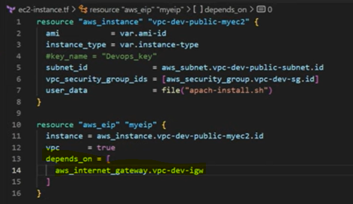

# DEPENDS ON
- To handle hidden resource or module dependencies that Terraform cannot automatically infer.
- To handle resources or modules that are not yet supported by Terraform.

- Depends on ex: IGW --> associate with EC2 --> EIP
- We need an EC2 instance for which we need EIP and IGW
- So we need to create IGW, EIP and then EC2 

- 
- Here we are creating EIP which is depends on IGW to the internet access public 
- When the IGW is created the EIP will be associated with the EC2 instance

