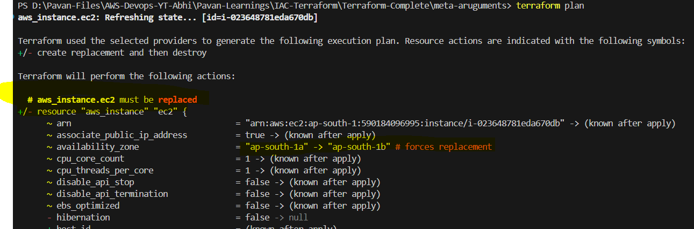
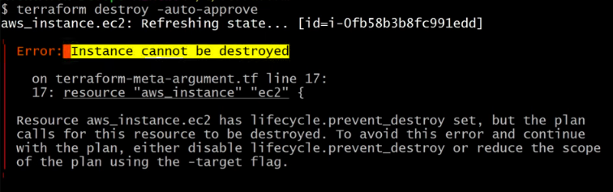
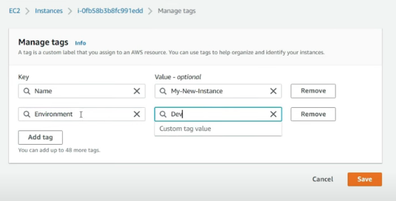
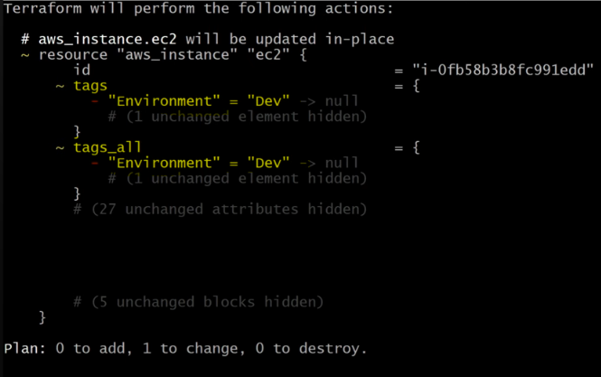
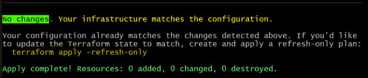

# LIFECYCLE

## CREATE BEFORE DESTROY
- By Default first resource get destroy and after that desired resource get created
- If we are not mentioning like where the availability zone then AWS will decide where it should create the easy to instance but if you define in the code then it will create in desired AZ

- ```
resource "aws_instance" "ec2" {
    ami = "ami-0e53db6fd757e38c7"
    instance_type = "t2.micro"
    # availability_zone = "ap-south-1a"
    availability_zone = "ap-south-1b"

    tags = {
      Name = "My-First-Instance"
    }

    lifecycle {
      create_before_destroy = true
    }
  
}
```
- By default terraform will delete the previous instance which is there in ap-south-1a availability zone and it will create new instance in ap-south-1b availablilty zone.
 -
- 1st it will destroy in AZ ap-south-1a and then it will create in ap-south-1b ( Default future of Terraform )
- BUT IF WE USE ``` create_before_destroy = true ```, THEN 1ST IT WILL CREATE NEW INSTANCE AND THEN DELETE THE OLD INSTANCE.

## PREVENT DESTROY
- By using `before_destroy` method we can prevent destroy of resource
- Safety against the accidental deletion of resources.
- In some cases we need instance to be prevented from the deletion so in that case we use like life cycle policy prevention destroy true so whenever any developer or a DevOps engineer wants to delete it it will show her life cycle policy has been enabled for this we can't delete this stuff something like that.
- ``` prevent_destory = true ``` 
- We use only terraform destroy functionality for this, not plan
- 


## IGNORE CHANGES
- By using `ignore_changes` we can prevent changes of resource
- This is useful when we don't want to update the resource but still want to use it.
- Not very useful for production env.
- We have already a tag,  But now we are creating new tag directly in the console :
- 
- But we haven't added in the terraform file, when we run terraform plan 
- 
- It identified that there is a change and So now what terraform will do is like it will delete that change which was manually added because it thinks like terraform state management will don't have this information that was added manually in the console directly right so it tries to match with the state and if state file is fine like then it will delete the change that already done manually in the concern OK.
- if we apply the manual change is deleted.
- But if we want to ignore the changes then we can use like this
- lifecycle policy of 
- ```
lifecycle {
#       ignore_changes = [ 
#         tags,
#        ]
#     }
```

- We can added multiple attributes like tags and etc
- SO THIS TIME TERRAFORM WILL NOT LOOK FOR TAGS, Be'coz we have mentioned in the ignore_changes
- 