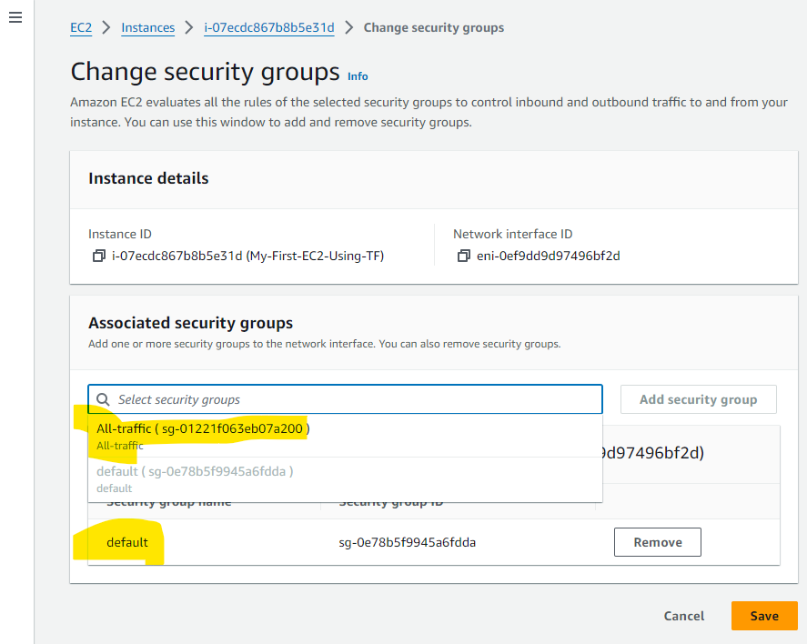
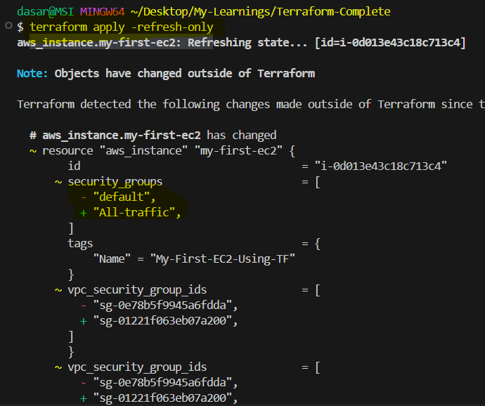

### Terraform Statefile Intro

- Terraform will manage the state management that means when infrastructure is created that management is done by terraform in the form of a state file so what are the infrastructure that are to be created or created will be stored in a state file.
- So this state file or terraform will check if the difference between actual resource and desired resource
- Here actual resource or actual state is nothing but what we have in the environment and desire is nothing but what we want to create resource.

### To pull the statefile form the remote repo
``` terraform state pull ```

### To rename resource in terraform statefile
- ```terraform state mv aws_vpc.myvpc2 aws_vpc.2myvpc``` ( To remote resource in statefile ) we can also use -backup-out="./"

### To remove resource in terrafrom statefile
- ``` terraform state rm aws_vpc.importvpc ``` use backup if needed
- If we have delete resource manaully then we can remove in statefile as well.

### To debug 
``` export TF_LOG=TRACE ```
- This will log warn,info, error and etc

### How to manage like manual changes into AWS resources directly in the console without using terraform

- 
- So what I want to do is like I want to change the actual vs or desired
- Show before like I have created an easy to instance I didnt mentioned any security groups over there but the security group it took case like default security group so now what I did is like I have changed default to alt traffic in the AWS conserve so let's see like what are the changes that we get here.
- ```
   "security_groups": [
                "default"
              ],
  ```
- This was like a default security group that was attached to an easy transistence when we haven't mentioned anything about the security groups in the my-frist.ec2.tf file.
- ```
  terraform apply -refresh-only
  ```
- When we use the above command like refresh only what he does is like if he did any changes in the infrastructure directly that means in the AWS consoles we can see the changes so let me show the changes here
- 
- Here what I did is like I have changed default to alt traffic in the A Ws Console and after that I have applied refresh only command now if I type S we'll see what happens.
- Now here we can see the difference like the backup file of Terraform will have the default security group
- ```
   "security_groups": [
                "default"
              ],
  ```
- And then state file has the updated security group with all traffic
- ```
  "security_groups": [
                "All-traffic"
              ],
  ```
- ```
  Certainly. Here are the key points about the terraform apply -refresh-only command:

  Updates Terraform's state file to match current real-world infrastructure
  Does not make any changes to actual infrastructure resources
  Detects drift between Terraform state and actual resources
  Identifies discrepancies caused by manual changes or external modifications
  Displays differences found between prior state and refreshed state
  Useful before other Terraform operations to ensure up-to-date state information
  Safer alternative to the deprecated terraform refresh command
  Helpful for auditing and maintaining accurate infrastructure representation
  Does not reconcile differences between Terraform configuration and actual infrastructure
  Requires explicit confirmation before making state changes

  ```
