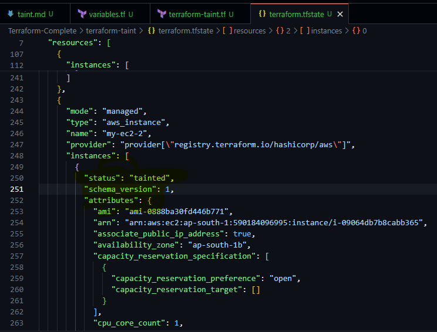
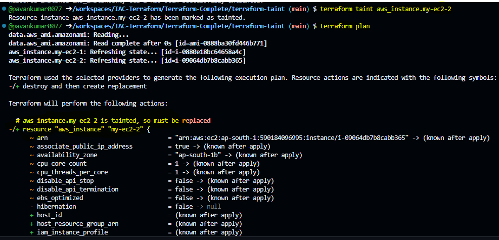

# Terraform Taint

- The terraform taint command infroms terraform that a particular object has become degraded or damanged.
- The terraform taint command manaully marks a terraform-managed resource a tainted, forcing it to be destroyted and recreated on the next apply.

```
Terraform’s taint feature allows you to mark a specific resource for recreation on the next apply. When a resource is "tainted," Terraform will destroy the current resource and create a new one during the next terraform apply. This can be useful when a resource is in a bad state or needs to be replaced without any actual configuration changes.

```

Use case
--
- It could use for re-creating an EC2 instance if someone logged in and made some manual changes.
- Making a resource as taint, force a rebuild of certain resources without doing a full destory - though usually only during development phase.

Behavior
==
- This command will not modify infrastructure, but does modify the state file in order to make a resource as tainted.
- Once a resource is marked as tained, the next plan will show that the resource will be destroyed and recreated and the next apply will implement this change.


- It will not modify the infrastructure in the state file

Code explaination
--
- As we have created 2 ec2 instances,
- One of the instance is used by one developer and installed some pkg's and config's and created a mess, That is not mentioned on the terraform file.
- So when we do terraform apply on the next time will be serveral changes 


- To taint the instance - ``` terraform taint aws_instance.my-ec2-2 ```
- To Untaint the instance - ``` terraform untaint aws_instance.my_instance ```

- NOTE : TAINT WILL ONLY CHANGE IN THE STATE FILE ONLY NOT ON THE RESOUCE LEVEL
- 
- If we want to untaint we have to use the untaint command, but not directly modifing the statefile
- 
- As we can the resouce will be my-ec2-2 instance will be deleted and re-create it.
