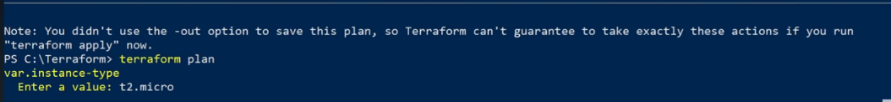
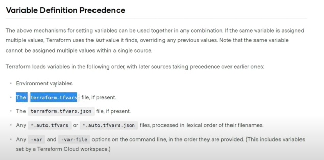
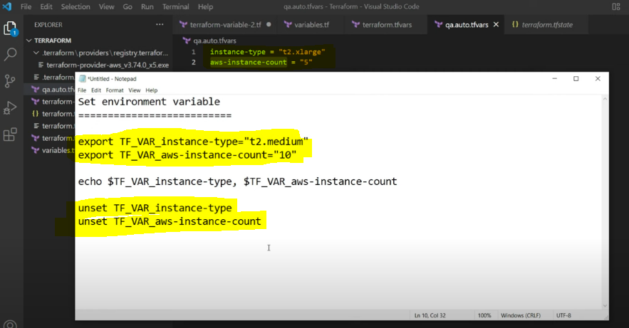

VARIABLES
--
- We need to variablise the values to reuse it
- Let's say for example invariables.tf file if you are not mentioning the default value of the instance and you are running terraform plan why the execution time it will ask for the what is the value of the instance type.
- 
- So to avoid this we need to define the variables in the variables.tf file
- Let's say for example there is a situation where we need to increase the instant size from T to micro to T2 large something like that but the thing here is you have only have read access to the terraform files but you need to do it so in this case we can run or override previous configuration using terraform CLI.
- ``` terraform plan -var instance_type="t2.large" ```
- So here we are overriding the instance type from the variables.tf file
- When we are providing values in this year line it will take as higher priority on this.
- So let's say for example if you are running terraform apply and you are providing the value.
- ``` terraform plan -var instance_type="t2.large" -var aws-instance-count=1 ```
- or
- ``` terraform apply -var instance_type="t2.large" -var aws-instance-count=1 ```
- We can pass multiple variables as well from the CLI, Once you want to apply the changes you can apply directly from the above command.
- So we can do one thing like we are using multiple variables in the CLI for multiple amount of times right so instead of that we can use like this as well we can save the plan as well let me show with an example.
- ``` terraform plan -var instance_type="t2.large" -var aws-instance-count=1 -out myplan.plan ```
- So here we are saving the plan in the myplan.plan file
- Now we can apply the plan using the following command
- ``` terraform apply myplan.plan ```
- ```https://developer.hashicorp.com/terraform/language/values/variables ```
- So here we are applying the plan from the myplan.plan file
- The plan which was generated is in binary format so we can't read it
- So when we apply the plan The thing is like it will automatically get auto upload so there will not be any prompt to manually we need to type yes to create the resources.
- VARIABLE DEFINITION PRECEDENCE
- 
- ``` Tterraform.tfvars ``` HAVE HIGHER PRECEDENCE.
- In different different environments like if you have multiple wearable files like QA prod pre prod stage something like that in that case we need to mention the variable file name as well as mentioned below.So that the variables only referred here is prod.tfvars that's it
- ``` terraform plan -var-file="prod.tfvars ```
- Let's say for example you are using prod environment continuously and every time you don't want to mention the file name over here and you want to make that variables file as a default file so how can we do that we can  when we can use or rename the file name as prod.auto.tfvars
- ``` prod.auto.tfvars ```
- Let's say for example you want to use prod variables as default variables then we need to mention prod.auto.tfvars and in the same way we can use for the staging and UAT something like that.
- FROM NOW WE CAN USE SIMPLE PLAN ``` terraform plan ``` command it will only look for ``` prod.auto.tfvars ``` it will give HIGHER PERCEDENCE.

Set Env in Linux Machine
--
- 
- Use export to set the variables
- Use unset to remove the variables


COUNT
--
- We can use count to create multiple instances of the same resource
- Let's say for example we need to create 3 instances of the same resource
- ``` https://developer.hashicorp.com/terraform/language/meta-arguments/count ```
- 
